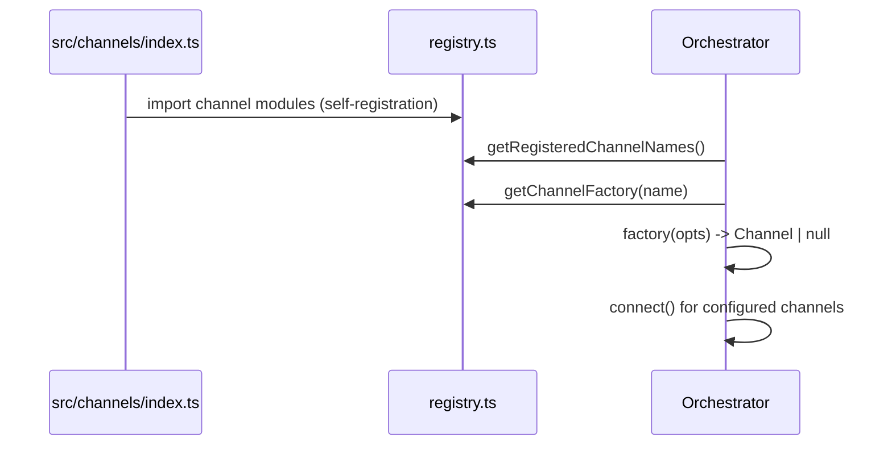
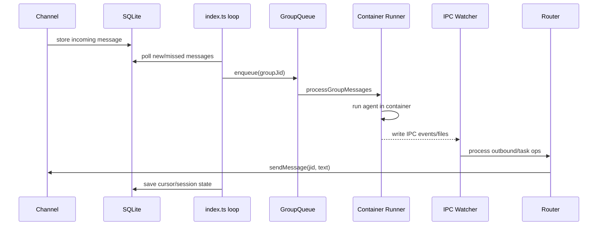

# NanoClaw Architecture (Repository Reference)

This document is the **code-first architecture reference** for this repository. It complements the public docs and is intended for maintainers and contributors.

## 1) High-level system

NanoClaw runs as one Node.js orchestrator process on the host. It persists state in SQLite and executes agent work inside isolated containers.

```mermaid
flowchart LR
  subgraph Host[Host process (Node.js)]
    C[Channels]
    L[Message loop\n(polling)]
    Q[Group queue\n(per-group serialization)]
    S[Task scheduler]
    I[IPC watcher]
    R[Router]
    D[(SQLite)]
  end

  subgraph Container[Container runtime]
    A[Claude Agent Runner]
    W[/workspace/group\nmounted group folder/]
  end

  C -->|incoming messages| D
  L -->|read new messages| D
  L --> Q
  S --> Q
  Q -->|run agent| A
  A <--> W
  A -->|tool outputs / task updates| I
  I --> R
  R -->|send outbound| C
  L -->|persist cursor/session| D
  S -->|read tasks| D
```

## 2) Runtime responsibilities

- **Orchestrator (`src/index.ts`)**: initializes DB/runtime/channels, restores state, runs loops, and dispatches work to the queue.
- **Group queue (`src/group-queue.ts`)**: prevents concurrent agent execution per group while allowing bounded global concurrency.
- **Container runner (`src/container-runner.ts`)**: launches agent jobs in container sandboxes and wires mounts, snapshots, and streaming.
- **Scheduler (`src/task-scheduler.ts`)**: computes due cron tasks and enqueues group work.
- **IPC watcher (`src/ipc.ts`)**: ingests filesystem IPC events from container jobs and forwards to router/task handlers.
- **Router (`src/router.ts`)**: resolves destination channel + JID and formats outbound content.
- **Database layer (`src/db.ts`)**: message/task/group/session persistence and router state cursors.

## 3) Channel architecture

Channels are plugin-like modules that self-register factories at import time.



Design implications:

- The core can ship without concrete channel implementations.
- Skills can add channels by adding module + barrel import.
- Missing credentials can safely return `null` from factory to skip startup.

## 4) Message processing lifecycle



Key behaviors implemented in code:

- Cursor recovery uses the last bot message when in-memory cursor is missing.
- Non-main groups can require trigger matching before agent execution.
- Queue ordering and state persistence protect against duplicate reprocessing after restart.

## 5) Isolation and boundaries

### Host boundary
- Main process has channel credentials and orchestrator state.
- SQLite database stores canonical state and message history.

### Container boundary
- Each group executes in its own mounted working directory.
- Only explicit mounts are available to agent tools.
- IPC is filesystem-based, minimizing direct process coupling.

## 6) Data model summary

Primary persisted concepts (via `src/db.ts`):

- **Messages**: inbound/outbound content with timestamps and sender metadata.
- **Groups**: mapping of chat JID to local group folder + policies.
- **Sessions**: per-group Claude session continuity.
- **Tasks**: scheduled recurring work.
- **Router state**: poll timestamps and per-group last-agent cursor.

## 7) Operational loops

- **Message poll loop**: reads new channel messages and dispatches work.
- **Scheduler loop**: checks due tasks and dispatches task runs.
- **IPC watcher**: continuously handles container-originated side effects.

These loops are independent but coordinated through DB state and queue semantics.

## 8) Extension points

1. **New channel**
   - Implement `Channel` interface.
   - Register factory in `src/channels/registry.ts` via module side-effect.
   - Add import in `src/channels/index.ts`.

2. **New tool capability inside agent**
   - Extend container runtime/tool wiring in `src/container-runner.ts` and `container/agent-runner`.

3. **Scheduling enhancements**
   - Extend task schema/parsing in `src/task-scheduler.ts` and DB migrations.

## 9) File map for architecture review

- `src/index.ts`
- `src/channels/registry.ts`
- `src/channels/index.ts`
- `src/group-queue.ts`
- `src/container-runner.ts`
- `src/container-runtime.ts`
- `src/task-scheduler.ts`
- `src/ipc.ts`
- `src/router.ts`
- `src/db.ts`
